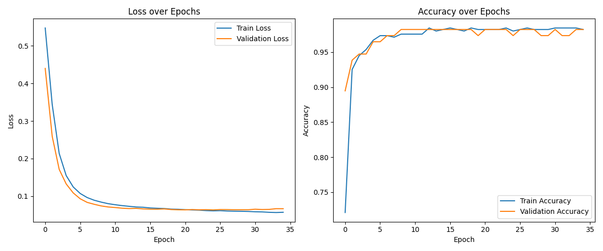

# Multilayer Perceptron - École 42

Implémentation d'un **perceptron multicouche (MLP) entièrement codé _from scratch_**, sans aucune bibliothèque de machine learning, pour prédire si une tumeur du sein est **maligne (M)** ou **bénigne (B)** à partir du dataset *Breast Cancer Wisconsin* (30 features décrivant le noyau cellulaire d'une masse mammaire).

L'objectif du projet est de comprendre et de réimplémenter les algorithmes au cœur de l'entraînement d'un réseau de neurones : **feedforward**, **backpropagation** et **descente de gradient**.

## Aperçu



Courbes de *loss* et d'*accuracy* (entraînement vs. validation) générées à la fin de l'entraînement.

## Architecture du réseau

Réseau *feedforward* dense par défaut :

| Couche | Neurones | Activation | Initialisation |
| --- | --- | --- | --- |
| Entrée | 30 (features) | — | — |
| Cachée 1 | 24 | sigmoid | Glorot uniform |
| Cachée 2 | 24 | sigmoid | Glorot uniform |
| Sortie | 2 | softmax | Glorot uniform |

- **Sortie softmax** → distribution de probabilité sur les deux classes (M / B).
- **Loss** : categorical cross-entropy.
- **Hyperparamètres par défaut** : learning rate `0.01`, batch size `8`, `100` epochs.

Tout est implémenté à la main en NumPy : fonctions d'activation (ReLU, sigmoid, softmax) et leurs dérivées, initialiseurs de poids (Glorot / He uniform), fonctions de coût (categorical & binary cross-entropy), propagation avant et rétropropagation par mini-batch avec mélange (*shuffle*) des données à chaque epoch.

## Structure du projet

| Fichier | Rôle |
| --- | --- |
| `dataset.py` | Exploration et visualisation des features (*swarm/strip plots* par classe) |
| `preproc.py` | Pré-traitement : standardisation (`StandardScaler`) et séparation train/validation stratifiée (80/20) |
| `train.py` | Définition du MLP, entraînement, affichage et sauvegarde de l'historique |
| `data.csv` | Dataset brut |
| `data_train.csv` / `data_valid.csv` | Jeux d'entraînement et de validation générés |
| `train_history.csv` | Historique des métriques par epoch |
| `requirements.txt` | Dépendances |

## Stack

Python · NumPy · Pandas · Matplotlib · Seaborn · scikit-learn *(uniquement pour le scaling et le split, pas pour le modèle)*

## Installation

```bash
pip install -r requirements.txt
```

## Utilisation

```bash
# 1. (Optionnel) Explorer et visualiser les données
python dataset.py

# 2. Pré-traiter : standardiser et générer data_train.csv / data_valid.csv
python preproc.py

# 3. Entraîner le modèle et afficher les courbes de loss / accuracy
python train.py
```

À la fin de l'entraînement, les métriques (*loss* et *accuracy*, train + validation) sont affichées à chaque epoch, l'historique est sauvegardé dans `train_history.csv` et les courbes d'apprentissage sont tracées.

## Compétences mises en œuvre

- Réseaux de neurones et perceptron multicouche
- Feedforward, backpropagation et descente de gradient (implémentés _from scratch_)
- Algèbre linéaire et calcul de dérivées en NumPy
- Pré-traitement de données : standardisation, séparation train/validation stratifiée
- Analyse exploratoire et visualisation
- Classification binaire et évaluation de modèle (loss, accuracy)

## Concepts clés

- **Feedforward** : propagation des données de la couche d'entrée vers la sortie.
- **Backpropagation** : calcul du gradient de l'erreur couche par couche, de la sortie vers l'entrée.
- **Descente de gradient** : mise à jour des poids et des biais dans la direction qui minimise la fonction de coût.
- **Softmax** : transforme les sorties en distribution de probabilité pour la classification.

---

*Projet réalisé dans le cadre de la spécialisation Data Science & IA de l'École 42 Angoulême.*
